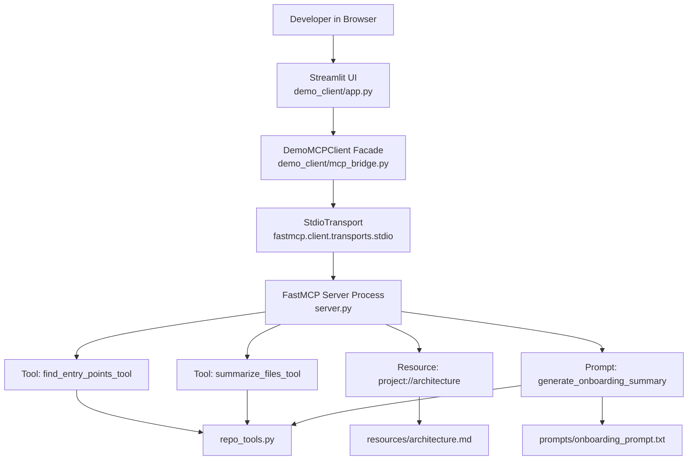
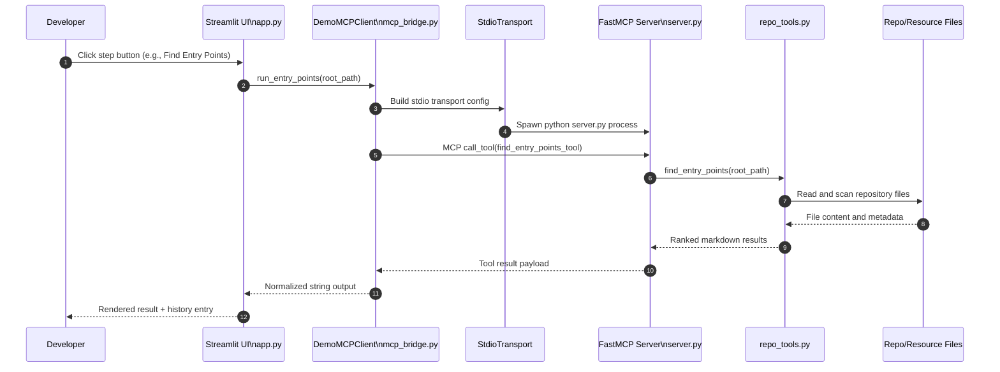

# MCP Server and Client Architecture (Developer Guide)

This document describes the runtime architecture of the Repo Onboarding Assistant demo at implementation level, covering both:

- MCP server internals (`server.py` + `repo_tools.py`)
- Guided browser client internals (`demo_client/app.py` + `demo_client/mcp_bridge.py`)

It also includes interaction diagrams for the end-to-end request flow.

## 1. System Intent and Design Constraints

The system provides repository onboarding capabilities over MCP using a strict read-only model.

Core design constraints:

- No repository mutation in tool handlers
- No execution of user repository code
- Bounded reads for predictable payload sizes
- Deterministic, inspectable output format (markdown/text)
- Decoupling between UI and analysis logic through MCP transport

These constraints are implemented mostly in `repo_tools.py` and in the server registration model in `server.py`.

## 2. High-Level Component Architecture

## 3. MCP Server Architecture

### 3.1 Server bootstrap and registration

The server process is defined in `server.py`:

- Instantiates `FastMCP("repo-onboarding-assistant")`
- Registers two tools, one resource, one prompt via decorators
- Runs with `mcp.run()` when executed as main

Registration points:

- `@mcp.tool()` -> `summarize_files_tool(paths: list[str])`
- `@mcp.tool()` -> `find_entry_points_tool(root_path: str = ".")`
- `@mcp.resource("project://architecture")` -> `architecture_resource()`
- `@mcp.prompt()` -> `generate_onboarding_summary(project_name: str = "this project")`

### 3.2 Handler responsibilities

#### `summarize_files_tool`

- Thin wrapper over `repo_tools.summarize_files`
- Returns markdown summaries of provided files
- Maintains separation: transport/protocol in `server.py`, analysis logic in `repo_tools.py`

#### `find_entry_points_tool`

- Thin wrapper over `repo_tools.find_entry_points`
- Produces ranked candidate startup files using heuristics

#### `architecture_resource`

- Maps URI `project://architecture` to `resources/architecture.md`
- Uses `_read_text_or_fallback` to return fallback text instead of hard failure
- Ensures resource endpoint remains resilient even if markdown file is missing

#### `generate_onboarding_summary`

Composes a reusable prompt package by combining:

- Static template from `prompts/onboarding_prompt.txt`
- Stable architecture context from `resources/architecture.md`
- Live, computed entry points from `find_entry_points`

This function acts as an orchestration layer that merges static and dynamic context into one payload for downstream AI generation.

### 3.3 Repo analysis core (`repo_tools.py`)

`repo_tools.py` is the analysis engine.

Key internals:

- `MAX_SUMMARY_READ_CHARS = 12_000`
- `MAX_PREVIEW_LINES = 8`
- `IGNORED_DIRS` skips dependency/build/cache folders
- `_is_virtualenv_subpath(...)` excludes nested virtual environments by detecting `pyvenv.cfg`

Main functions:

#### `summarize_files(paths)`

Per path behavior:

- Resolves relative paths against current working directory
- Distinguishes missing paths, directories, binary files, readable files
- Reads bounded content via `_safe_read_text`
- Derives purpose hint with `_file_purpose_hint`
- Emits markdown metadata + preview snippet

Safety properties:

- Never executes file contents
- Binary detection via null-byte check
- Read-size cap limits resource and token usage

#### `find_entry_points(root_path)`

Discovery model:

- Recursive scan from resolved `root_path`
- Filters by `IGNORED_DIRS` + virtualenv detection
- Baseline filename score from `ENTRY_POINT_SCORES`
- Adds content-based score increments for signals such as:
  - `if __name__ == "__main__"`
  - `def main(`
  - `fastmcp`, `@mcp.tool`
  - framework mentions (`uvicorn`, `flask`, `fastapi`)

Output model:

- Sorted candidate list by descending score
- Top 12 included in markdown
- Includes rationale strings for explainability

## 4. Guided Client Architecture

### 4.1 UI layer (`demo_client/app.py`)

The Streamlit app is a guided workflow client, not a direct analyzer.

Responsibilities:

- Validate user-selected repository path (`validate_repo_path`)
- Discover local candidate repositories (`discover_local_repos`)
- Capture step-specific user inputs (scan root, summary file list, project name)
- Execute guided steps 0-4
- Persist run results in `st.session_state.history`

Important architectural choice:

- The UI does not call `repo_tools.py` directly
- All analysis is routed through MCP calls using `DemoMCPClient`

This preserves protocol fidelity and demonstrates realistic client/server separation.

### 4.2 Bridge layer (`demo_client/mcp_bridge.py`)

`DemoMCPClient` provides a synchronous facade over async FastMCP client APIs.

Why this layer exists:

- Streamlit button handlers are easier to keep synchronous
- MCP Python client APIs are async
- Bridge hides transport/session lifecycle details from UI code

Implementation details:

- Uses per-operation `StdioTransport` with:
  - command: `mcpdemo/Scripts/python.exe`
  - args: `server.py`
  - cwd: repository root
  - `keep_alive=False` (new server process per operation)
- Each action maps to an async method:
  - `_list_capabilities_async`
  - `_run_entry_points_async`
  - `_run_summaries_async`
  - `_run_architecture_async`
  - `_run_onboarding_prompt_async`
- Public sync methods invoke async methods via `asyncio.run(...)`

Formatting helpers:

- `_to_pretty_json` for model-like output
- `_resource_to_text` for resource block normalization
- `_prompt_to_text` for prompt message extraction

## 5. Interaction Sequence (End-to-End)

## 6. MCP Primitive Coverage Matrix

| Primitive | Server Endpoint                 | Backing Source                                                       | Typical Consumer in UI |
| --------- | ------------------------------- | -------------------------------------------------------------------- | ---------------------- |
| Tool      | `find_entry_points_tool`      | `repo_tools.find_entry_points`                                     | Step 1                 |
| Tool      | `summarize_files_tool`        | `repo_tools.summarize_files`                                       | Step 2                 |
| Resource  | `project://architecture`      | `resources/architecture.md`                                        | Step 3                 |
| Prompt    | `generate_onboarding_summary` | `prompts/onboarding_prompt.txt` + architecture + live entry points | Step 4                 |

## 7. Error Handling and Resilience

### Server-side patterns

- Fallback text for optional file reads (`_read_text_or_fallback`)
- Graceful handling of read/decode failures in repo analysis
- Inline reporting of missing/unreadable paths instead of hard exceptions

### Client-side patterns

- UI-level path validation before enabling operations
- Per-step `try/except` wrappers with user-visible errors
- Empty-result guardrails (for example, no file list in Step 2)

## 8. Process and Lifecycle Model

Current transport setting is `keep_alive=False`, so each operation:

1. Creates transport
2. Spawns server process
3. Executes one MCP operation
4. Tears down session/process

Benefits:

- Strong operation isolation
- Simple lifecycle semantics for demo reliability

Trade-off:

- Additional process startup overhead per click

For production-style usage, a persistent session (`keep_alive=True` or alternate transport) can reduce latency and improve throughput.

## 9. Security and Safety Posture

Current posture is suitable for local demo and onboarding scenarios:

- Read-only repository inspection
- No tool exposes command execution
- Heuristic parser avoids deep code evaluation
- Ignored directories reduce accidental scanning of dependencies/venvs

Remaining considerations for harder environments:

- Add explicit path sandboxing constraints
- Add file type allow-lists if needed
- Introduce structured telemetry/auditing for tool invocations

## 10. Extensibility Guidance

High-value extension points:

- Add new tool endpoints in `server.py` with logic in `repo_tools.py`
- Add stable context resources under `resources/` and map to new MCP URIs
- Add role-specific prompt composers (onboarding, incident response, architecture review)
- Introduce language-specific entry-point heuristics beyond current filename/content signals

Recommended convention to preserve maintainability:

- Keep protocol plumbing in `server.py`
- Keep analysis logic in dedicated utility modules
- Keep UI logic in Streamlit app, with MCP bridge as the only transport boundary

## 11. Quick Developer Trace Paths

If you want to trace a full call path quickly:

1. Start at Streamlit handler in `demo_client/app.py` (step button)
2. Follow to sync bridge method in `demo_client/mcp_bridge.py`
3. Follow async call (`call_tool`, `read_resource`, `get_prompt`)
4. Inspect handler in `server.py`
5. Inspect analysis implementation in `repo_tools.py` or file-backed resource/prompt source

This sequence mirrors runtime exactly and is useful for debugging, profiling, or adding new capabilities.
